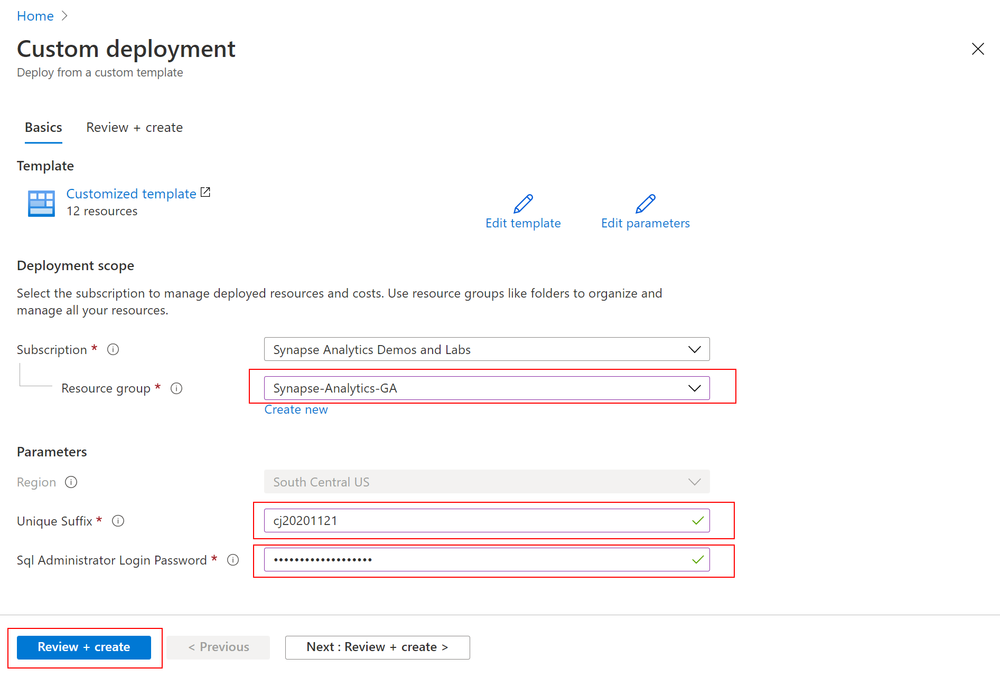
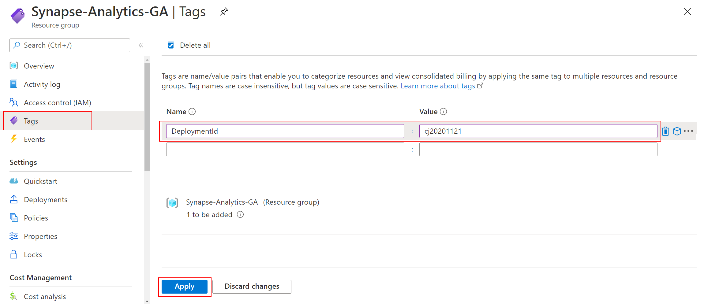
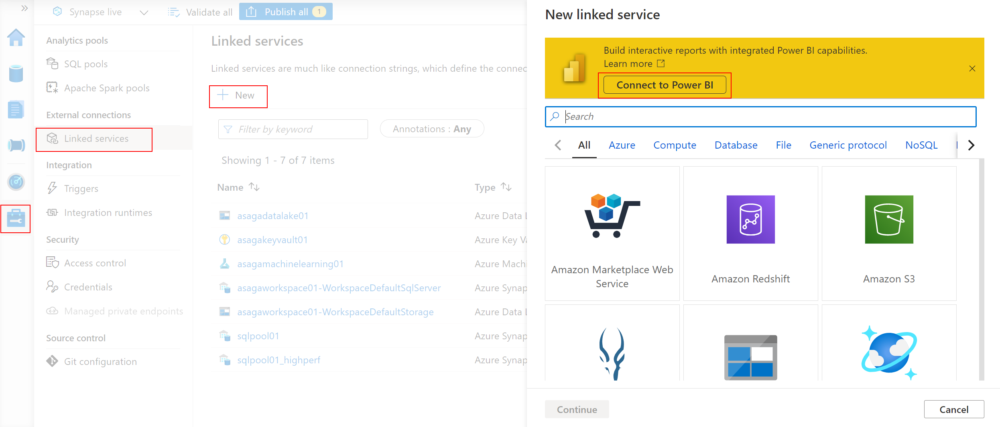
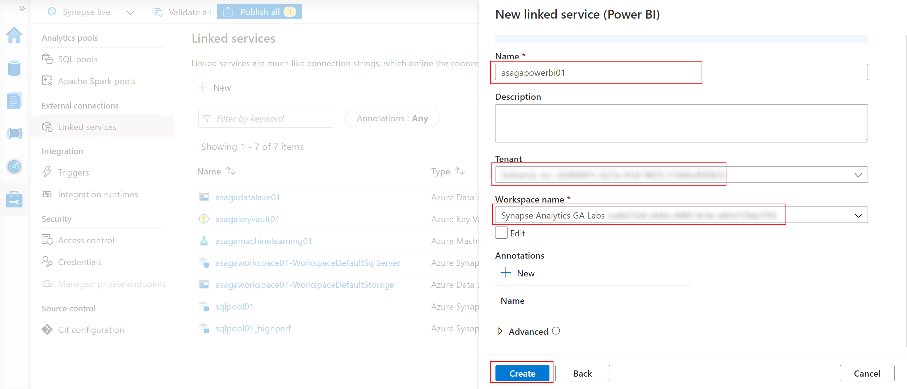
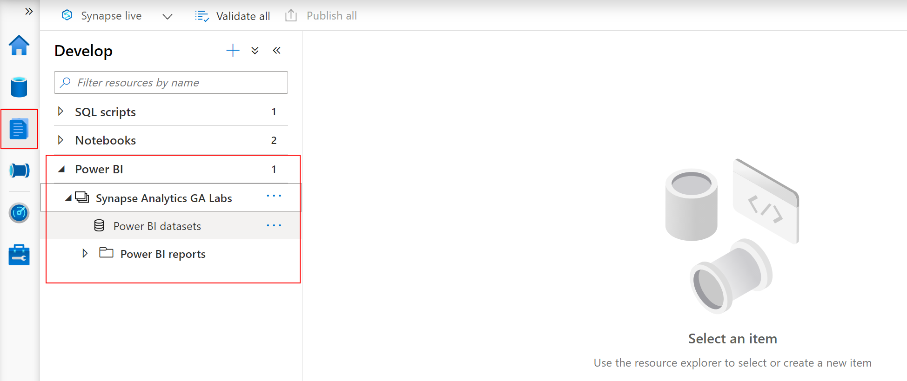

# Deploy your Azure Synapse Analytics workspace

## Pre-requisites for deployment

The following requirements must be met before the deployment:

- A resource group (this will be provided during the deployment process).

    >**IMPORTANT**
    >
    >In case you didn't create the resource group yourself, make sure your account has the `Owner` role on the resource group.
    >
    >Also, your account (i.e. the Azure AD account used to deploy the Azure Synapse Analytics workspace) must have permissions to create new resource groups in the subscription (this is required because Synapse Analytics requires an additional resource group to keep various hidden artifacts; this resource group is created during the deployment process).

- A unique suffix to be used when generating the name of the workspace. All workspaces deployed using the templates in this repo are named `asagaworkspace<unique_suffix>`, where `<unique_suffix>` gets replaced with the value you provide. Make sure the unique suffix is specific enough to avoid potential naming collisions (i.e. avoid using common values like `01`, `1`, `test`, etc.). Make sure you remember the unique suffix as you need to use it for additional configuration once the Azure Synapse Analytics workspace deployment is complete.
- A password for the SQL admin account of the workspace. Make sure you save the password in a secure location (like a password manager) as you will need to use it later.
- A GitHub account to access the GitHub repository.
- A Power BI Pro subscription attached to the Azure AD account you will use to setup the Synapse Analytics workspace. In case you do not have a paid Power BI Pro subscription, you can get a 60 days trial by signing in to `https://powerbi.com` with your account and selecting `Try free`.
- A Power BI Pro workspace (for details about creating a workspace in Power BI, see [Create the new workspaces in Power BI](https://docs.microsoft.com/en-us/azure/synapse-analytics/quickstart-power-bi)).

## Configure the Azure Cloud Shell

>**NOTE**
>
>If Cloud Shell is already configured, you can skip this section entirely and advance to [Deploy the Synapse Analytics workspace](#deploy-the-synapse-analytics-workspace).

In the Azure Portal, navigate to your resource group and create a new storage account to be used in the Cloud Shell configuration process (make sure the resource type you create is `Storage account`). In the newly created storage account, select `File shares` (under the `File service` settings group) and create a new file share.

Next, select the Cloud Shell icon (located in the top right part of the page) and then select `PowerShell`:


Select your subscription under `Subscription` if it's not already selected, and then select `Show advanced settings`:


Provide values for the following fields:

- **Cloud Shell region**: the same region as the region of your resource group.
- **Resource group**: select `Use existing` and then select you resource group from the list.
- **Storage account**: select `Use existing` and then select the storage account you created above.
- **File share**: select `Use existing` and then select the file share you created above.

Select `Attach storage` once all the values are in place.


Once configuration is complete, you should get an instance of Cloud Shell:


## Deploy the Synapse Analytics workspace

Click the `Deploy to Azure` button below to start the deployment process.

[](https://portal.azure.com/#create/Microsoft.Template/uri/https%3A%2F%2Fraw.githubusercontent.com%2Fsolliancenet%2Fazure-synapse-analytics-ga-content-packs%2Fmain%2Fhands-on-labs%2Fsetup%2Farm%2Fasaga-workspace-core.json%3Ftoken%3DAA2FKXRAGLJK2Q5PS7UV6QC7ZZAS2)

You should see next the `Custom deployment` screen where you need to provide the following (see [Pre-requisites for deployment](#pre-requisites-for-deployment) above for details):

- The resource group where the Synapse Analytics workspace will be deployed.
- The unique suffix used to generate the name of the workspace (**NOTE**: Make sure this value has a **maximum** length of **9 characters**).
- The password for the SQL Administrator account.

Select `Review + create` to validate the settings.



Once the validation is passed, select `Create` to start the deployment. You should see next an indication of the deployment progress:


Wait until the deployment completes successfully before proceeding to the next step.

## Tag your resource group with the unique suffix

In the Azure Portal, navigate to the resource group you used to deploy the Synapse Analytics workspace (see [Pre-requisites for deployment](#pre-requisites-for-deployment) above for details).

Select the `Tags` section and add a new tag named `DeploymentId`. Use the unique suffix as the value of the tag and then select `Apply` to save it.



The deployment of your Synapse Analytics workspace is now complete. Next, you will deploy the artifacts required by the labs into the newly created Synapse Analytics workspace.

## Run the global setup script in Cloud Shell

In the Azure Portal, navigate to the resource group you used to deploy the Synapse Analytics workspace (see [Pre-requisites for deployment](#pre-requisites-for-deployment) above for details) and start a Cloud Shell instance (see [Configure the Azure Cloud Shell](#configure-the-azure-cloud-shell) above for details).

Once the Cloud Shell instance becomes available, **run ```az login```** to make sure the correct account and subscription context are set:


Clone the content packs repository into the `asa` local folder using

```cmd
git clone https://github.com/solliancenet/microsoft-data-engineering-ilt-deploy asa
```

If GIT asks for credentials, provide your GitHub username and password.

>**IMPORTANT**
>
>If your GitHub account has two-factor authentication activated, you need to provide a PAT (Personal Access Token) instead your password. For more details, read the [Creating a personal access token](https://docs.github.com/en/free-pro-team@latest/github/authenticating-to-github/creating-a-personal-access-token) section in GitHub Docs.
>
>When pasting your password or PAT into the Cloud Shell window, make sure you are familiar with the supported key combinations (Shift-INS for Windows and Cmd-V for Mac). For more details, see [Using the Azure Cloud Shell window](https://docs.microsoft.com/en-us/azure/cloud-shell/using-the-shell-window#copy-and-paste).

Once the repository is successfully cloned, you shoud see a result similar to this:


Change your current directory using

```cmd
cd asa/setup/17/automation
```

and then start the setup script using

```powershell
.\environment-setup.ps1
```

Make sure the selected subscription is the one that contains the resource group where you deployed the Synapse Analytics workspace:


Enter the name of the resource group where you deployed the Synapse Analytics workspace:


The setup script will now proceed to create all necessary Synapse Analytics artifacts in your environment.

The process should take 5 to 10 minutes to finish. Wait until the setup script is finished before proceeding to the next steps.

## Connect the Azure Synapse Analytics workspace to your Power BI workspace

In the Azure Portal, navigate to your resource group, open the Synapse workspace resource (should be named `asagaworkspace<unque_suffix>` where `<unique_suffix>` is the one you specified when creating the workspace), and then open Synapse Studio.

In Synapse Studio, select the `Manage` hub on the left side, select `Linked Services`, and then select `+ New` to start creating a new linked service. Select `Connect to Power BI` to start configuring the linked service (if the `Connect to Power BI` option does not show up, enter `Power BI` in the search box, select `Power BI` and then select `Continue`).



In the `New linked service (Power BI)` dialog enter settings as follows:

- **Name**: enter `asagapowerbi<unique_suffix>` (where `<unique_suffix>` is the one you specified when creating the Synapse Analytics workspace).
- **Tenant**: ensure the correct tenant is selected (the one that contains your Azure AD account).
- **Workspace name**: select the Power BI workspace you want to use.

Select `Create` to create the Power BI linked service.



After the linked service is successfully created, select the `Develop` hub on the left side and expand the `Power BI` section. You should see your Power BI workspace listed.


